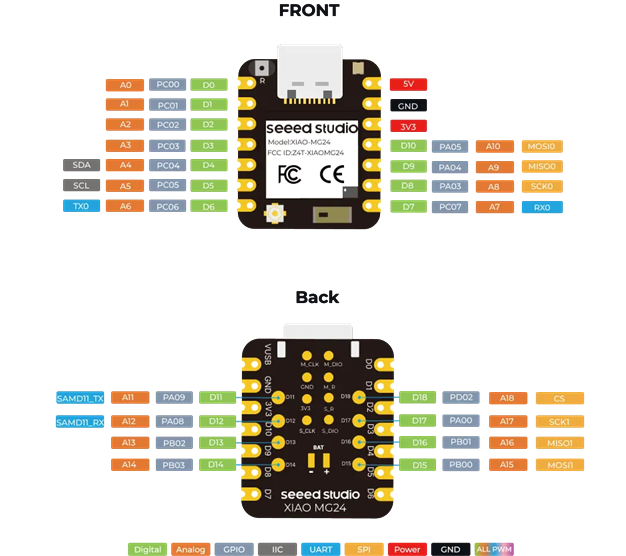

# XIAO MG24 Sense + LIR2032 バッテリー基板 - JLCPCB発注ガイド

Seeed Studio XIAO MG24 SenseをLIR2032充電式コイン電池で駆動するためのKiCadプロジェクト作成からJLCPCBへの発注までの完全ガイドです。

## 📋 プロジェクト概要

### 使用部品
- **XIAO MG24 Sense**: Seeed Studio製開発ボード (BLE 5.3, IMU, マイク搭載)
- **CR2032ホルダー**: 秋月電子通商 CH25-2032LF (LIR2032対応)
- **LIR2032**: 充電式コイン電池 (3.6V, 40mAh)

### プロジェクト構成
```
XIAO-MG24-Sense-Battery/
├── XIAO-MG24-Sense/          # XIAOのKiCadライブラリ
│   ├── XIAO-MG24-Sense.kicad_sym
│   ├── XIAO-MG24-Sense.kicad_mod
│   └── README.md
├── CR2032-holder/            # CR2032ホルダーのKiCadライブラリ
│   ├── CR2032-Holder.kicad_sym
│   ├── CR2032-Holder.kicad_mod
│   └── README.md
└── [プロジェクトフォルダ]     # これから作成
```

### XIAO MG24 Senseピンアウト

XIAO MG24 Senseは21mm × 17.5mmの小型開発ボードで、14ピン + バッテリーパッドを備えています。

#### 公式ピンアウト図



*出典: [Seeed Studio XIAO MG24 Sense 製品ページ](https://jp.seeedstudio.com/Seeed-XIAO-MG24-Sense-p-6248.html)*

#### ピン配置図 (簡易版)

```
        ┌─────────[USB-C]─────────┐
        │                         │
   5V  │● 14                     │  ← 5V電源入力
    RX  │●  8                     │
   SCK  │●  9                     │
  MISO  │● 10                     │
   D10  │● 11                     │
   3V3  │● 12                     │  ← 3.3V電源出力
   GND  │● 13                     │  ← グランド
        │                         │
        │    XIAO MG24 Sense      │
        │                         │
    D0  │●  1                     │
    D1  │●  2                     │
    D2  │●  3                     │
    D3  │●  4                     │
   SDA  │●  5                     │  ← I2C データ
   SCL  │●  6                     │  ← I2C クロック
    TX  │●  7                     │
        │                         │
        └──────[BAT+] [BAT-]──────┘
                 ↑       ↑
            バッテリーパッド
```

#### ピン機能一覧

| ピン番号 | 名称 | 主な機能 | 代替機能 | 説明 |
|---------|------|---------|---------|------|
| **1** | D0 | GPIO | PA08 | 汎用I/O |
| **2** | D1 | GPIO | PA09 | 汎用I/O |
| **3** | D2 | GPIO | PB00 | 汎用I/O |
| **4** | D3 | GPIO | PB01 | 汎用I/O |
| **5** | D4 | GPIO / **SDA** | PC04 | I2C データライン |
| **6** | D5 | GPIO / **SCL** | PC05 | I2C クロックライン |
| **7** | D6 | GPIO / **TX** | PC06 | UART 送信 |
| **8** | D7 | GPIO / **RX** | PC07 | UART 受信 |
| **9** | D8 | GPIO / **SCK** | PA03 | SPI クロック |
| **10** | D9 | GPIO / **MISO** | PA04 | SPI データ入力 |
| **11** | D10 | GPIO | PA00 | 汎用I/O |
| **12** | 3V3 | 電源出力 | - | 3.3V出力 (最大700mA) |
| **13** | GND | グランド | - | グランド |
| **14** | 5V | 電源入力 | - | USB 5V入力 (最大500mA) |
| - | BAT+ | バッテリー+ | - | 3.3V～4.2V (充電式電池用) |
| - | BAT- | バッテリー- | - | バッテリーグランド |

#### 電源仕様

- **USB電源**: 5V (ピン8経由)
- **バッテリー電源**: 3.3V～4.2V (BAT+/BAT-パッド経由)
- **3.3V出力**: 最大700mA (ピン13)
- **動作電圧範囲**: 2.0V～3.6V

> [!WARNING]
> **LIR2032使用時の注意**
> - LIR2032の公称電圧は3.6V (満充電時4.2V)
> - BAT+パッドに接続する場合、電圧が3.6Vを超えないよう注意
> - より安全な接続方法は、5Vピンにダイオード経由で接続し、内蔵レギュレータを使用すること

#### 内蔵センサー

XIAO MG24 Senseには以下のセンサーが搭載されています:
- **IMU**: LSM6DS3 (6軸加速度・ジャイロセンサー)
- **マイク**: PDMマイク

これらのセンサーは内部I2Cバスに接続されており、外部ピンを使用せずにアクセスできます。

---

## ステップ1: KiCadプロジェクトの作成

### 1.1 新規プロジェクトの作成

1. **KiCad 9.0**を起動
2. 「ファイル」→「新規プロジェクト」を選択
3. プロジェクト名を入力 (例: `XIAO-MG24-Battery-Board`)
4. 保存場所を`XIAO-MG24-Sense-Battery`ディレクトリ内に指定
5. 「保存」をクリック

### 1.2 プロジェクト構成の確認

作成後、以下のファイルが生成されます:
```
XIAO-MG24-Battery-Board/
├── XIAO-MG24-Battery-Board.kicad_pro    # プロジェクトファイル
├── XIAO-MG24-Battery-Board.kicad_sch    # 回路図ファイル
└── XIAO-MG24-Battery-Board.kicad_pcb    # PCBレイアウトファイル
```

---

## ステップ2: ライブラリの追加

### 2.1 シンボルライブラリの追加

1. KiCadメインウィンドウで「設定」→「シンボルライブラリを管理」を開く
2. 「プロジェクト固有のライブラリ」タブを選択
3. 「追加」ボタン(+)をクリック

#### XIAO MG24 Senseシンボルの追加
- **ニックネーム**: `XIAO-MG24-Sense`
- **ライブラリパス**: `${KIPRJMOD}/../XIAO-MG24-Sense/XIAO-MG24-Sense.kicad_sym`

#### CR2032ホルダーシンボルの追加
- **ニックネーム**: `CR2032-Holder`
- **ライブラリパス**: `${KIPRJMOD}/../CR2032-holder/CR2032-Holder.kicad_sym`

4. 「OK」をクリックして保存

### 2.2 フットプリントライブラリの追加

1. KiCadメインウィンドウで「設定」→「フットプリントライブラリを管理」を開く
2. 「プロジェクト固有のライブラリ」タブを選択
3. 「フォルダを追加」ボタンをクリック

#### XIAO MG24 Senseフットプリントの追加
- **ニックネーム**: `XIAO-MG24-Sense`
- **ライブラリパス**: `${KIPRJMOD}/../XIAO-MG24-Sense`

#### CR2032ホルダーフットプリントの追加
- **ニックネーム**: `CR2032-holder`
- **ライブラリパス**: `${KIPRJMOD}/../CR2032-holder`

4. 「OK」をクリックして保存

---

## ステップ3: 回路図の作成

### 3.1 回路図エディタを開く

1. KiCadメインウィンドウで「回路図エディタ」をクリック
2. 新しい回路図ウィンドウが開きます

### 3.2 部品の配置

#### XIAO MG24 Senseの配置
1. `A`キーを押して「シンボルを追加」
2. フィルタに「XIAO」と入力
3. `XIAO-MG24-Sense:XIAO_MG24_Sense`を選択
4. 回路図上でクリックして配置
5. リファレンス: `U1`

#### CR2032ホルダーの配置
1. `A`キーを押して「シンボルを追加」
2. フィルタに「CR2032」と入力
3. `CR2032-Holder:CR2032_Holder`を選択
4. 回路図上でクリックして配置
5. リファレンス: `BT1`

### 3.3 配線

#### 基本的な電源接続
1. **ワイヤーツール**(`W`キー)を使用して以下を接続:
   - `BT1`のピン1(+) → `U1`の3V3ピン
   - `BT1`のピン2(-) → `U1`のGNDピン

> [!IMPORTANT]
> **LIR2032の電圧について**
> - LIR2032の公称電圧は3.6V (満充電時4.2V)
> - XIAO MG24 Senseの動作電圧範囲: 2.0V～3.6V
> - 3V3ピンに直接接続する場合、電圧レギュレータをバイパスすることになります
> - より安全な接続方法は、5Vピンにダイオード経由で接続し、内蔵レギュレータを使用することです

#### 推奨回路(オプション)
より安全な電源供給のため、以下の回路を推奨します:

1. **ショットキーダイオード追加** (例: 1N5819)
   - LIR2032(+) → ダイオードアノード
   - ダイオードカソード → XIAO 5Vピン
   - LIR2032(-) → XIAO GND

2. **充電回路の追加** (オプション)
   - USB 5V → 充電ICまたは抵抗 → LIR2032(+)
   - 充電電流制限抵抗: 約100Ω (50mA充電)

### 3.4 回路図の保存

1. `Ctrl + S`で保存
2. 「ツール」→「電気ルールチェック(ERC)」を実行
3. エラーがないことを確認

---

## ステップ4: PCBレイアウトの作成

### 4.1 PCBエディタを開く

1. 回路図エディタで「ツール」→「PCBを更新」をクリック
2. 「PCBを更新」ダイアログで「PCBを更新」をクリック
3. PCBエディタが開き、部品が読み込まれます

### 4.2 基板外形の設定

1. **レイヤー**を`Edge.Cuts`に変更
2. **円ツール**または**線ツール**を使用して基板外形を描画
3. 推奨サイズ: 30mm × 40mm (XIAO + CR2032ホルダーが収まるサイズ)

#### JLCPCBの基板サイズ制約
- **最小サイズ**: 20mm × 20mm
- **最大サイズ** (標準価格):
  - 2層基板: 100mm × 100mm
  - 4層基板: 100mm × 100mm
- **推奨形状**: 長方形または正方形

### 4.3 部品の配置

1. **XIAO MG24 Sense (U1)**を基板中央付近に配置
2. **CR2032ホルダー (BT1)**をXIAOの近くに配置
3. 部品間のクリアランスを確保 (最低2mm以上)

#### 配置のヒント
- XIAOをスルーホール実装する場合、裏面にCR2032ホルダーを配置可能
- XIAOをSMD実装する場合、同じ面にCR2032ホルダーを配置

### 4.4 配線(ルーティング)

1. **配線ツール**(`X`キー)を使用
2. ラッツネスト(白い線)に従って配線
3. 電源ラインは太く(0.5mm以上)、信号ラインは0.25mm以上を推奨

#### JLCPCBの設計ルール
- **最小トレース幅**: 0.127mm (推奨: 0.2mm以上)
- **最小トレース間隔**: 0.127mm (推奨: 0.2mm以上)
- **最小ビア径**: 0.3mm (推奨: 0.45mm以上)
- **最小ドリル径**: 0.2mm (推奨: 0.3mm以上)

### 4.5 デザインルールチェック(DRC)

1. 「検査」→「デザインルールチェック」を実行
2. エラーを修正
3. すべてのエラーが解消されるまで繰り返す

---

## ステップ5: ガーバーファイルの生成

### 5.1 プロットの設定

1. PCBエディタで「ファイル」→「プロット」を選択
2. **出力ディレクトリ**: `gerber/` (自動作成されます)
3. **プロットフォーマット**: `Gerber`を選択

### 5.2 レイヤーの選択

以下のレイヤーにチェックを入れます:

**2層基板の場合:**
- ✅ `F.Cu` (表面銅箔)
- ✅ `B.Cu` (裏面銅箔)
- ✅ `F.SilkS` (表面シルクスクリーン)
- ✅ `B.SilkS` (裏面シルクスクリーン)
- ✅ `F.Mask` (表面ソルダーマスク)
- ✅ `B.Mask` (裏面ソルダーマスク)
- ✅ `Edge.Cuts` (基板外形)

### 5.3 オプション設定

- ✅ **ガーバーX2フォーマットを使用**
- ✅ **ネットリスト属性を含める**
- ✅ **Protel拡張子を使用**
- **座標フォーマット**: `4.6, unit mm`

### 5.4 ガーバーファイルの生成

1. 「プロット」ボタンをクリック
2. `gerber/`フォルダにファイルが生成されます

### 5.5 ドリルファイルの生成

1. プロットダイアログで「ドリルファイルを生成」をクリック
2. **ドリルファイルフォーマット**: `Excellon`
3. **ドリル単位**: `ミリメートル`
4. **ゼロフォーマット**: `小数点フォーマット`
5. 「ドリルファイルを生成」をクリック

### 5.6 生成されるファイル一覧

```
gerber/
├── XIAO-MG24-Battery-Board-F_Cu.gbr        # 表面銅箔
├── XIAO-MG24-Battery-Board-B_Cu.gbr        # 裏面銅箔
├── XIAO-MG24-Battery-Board-F_SilkS.gbr     # 表面シルク
├── XIAO-MG24-Battery-Board-B_SilkS.gbr     # 裏面シルク
├── XIAO-MG24-Battery-Board-F_Mask.gbr      # 表面マスク
├── XIAO-MG24-Battery-Board-B_Mask.gbr      # 裏面マスク
├── XIAO-MG24-Battery-Board-Edge_Cuts.gbr   # 基板外形
├── XIAO-MG24-Battery-Board.drl             # ドリルファイル
└── XIAO-MG24-Battery-Board-job.gbrjob      # ジョブファイル
```

---

## ステップ6: JLCPCBへの発注

### 6.1 ガーバーファイルのZIP圧縮

1. `gerber/`フォルダ内のすべてのファイルを選択
2. 右クリック→「送る」→「圧縮(ZIP形式)フォルダー」
3. ファイル名: `XIAO-MG24-Battery-Board-Gerber.zip`

> [!TIP]
> ZIPファイルには**フォルダを含めず、ファイルのみ**を圧縮してください。JLCPCBはルートにガーバーファイルがあることを期待しています。

### 6.2 JLCPCBアカウントの作成

1. [JLCPCB公式サイト](https://jlcpcb.com/)にアクセス
2. 「Sign up」をクリックしてアカウント作成
3. メールアドレスとパスワードを設定
4. メール認証を完了

### 6.3 見積もりと注文

#### 6.3.1 ガーバーファイルのアップロード

1. JLCPCBトップページで「Quote Now」または「Add gerber file」をクリック
2. 作成したZIPファイルをドラッグ&ドロップまたは選択
3. 自動的に基板サイズと層数が検出されます

#### 6.3.2 基板仕様の選択

| 項目 | 推奨設定 | 説明 |
|------|---------|------|
| **Base Material** | FR-4 | 標準的なガラスエポキシ基板 |
| **Layers** | 2 | 2層基板 |
| **Dimensions** | (自動検出) | 基板サイズ |
| **PCB Qty** | 5 | 最小注文数(5枚) |
| **Product Type** | Industrial/Consumer electronics | 用途 |
| **Different Design** | 1 | 異なる設計の数 |
| **Delivery Format** | Single PCB | 配送形式 |
| **PCB Thickness** | 1.6mm | 標準厚さ |
| **PCB Color** | Green | 基板色(緑が最安) |
| **Silkscreen** | White | シルク色 |
| **Surface Finish** | HASL(with lead) | 表面処理(鉛入りが最安) |
| **Outer Copper Weight** | 1 oz | 銅箔厚さ |
| **Gold Fingers** | No | 金メッキ端子 |
| **Confirm Production file** | No | 製造前確認 |
| **Flying Probe Test** | Fully Test | 電気テスト |
| **Castellated Holes** | No | キャステレーションホール |
| **Remove Order Number** | No | 注文番号削除(有料) |

#### 6.3.3 価格の確認

- **基板製造費**: 約$2～$5 (5枚)
- **送料**: 
  - **Global Standard Direct Line**: 約$2～$3 (7～15日)
  - **DHL/FedEx**: 約$20～$30 (3～5日)
- **合計**: 約$4～$35 (配送方法により変動)

> [!NOTE]
> 初回注文の場合、クーポンコードで割引が適用される場合があります。

### 6.4 配送先情報の入力

1. 「Save to Cart」をクリック
2. カートページで「Secure Checkout」をクリック
3. 配送先住所を入力:
   - 氏名(ローマ字)
   - 住所(ローマ字)
   - 電話番号
   - 郵便番号

### 6.5 支払い

1. 支払い方法を選択:
   - **PayPal**: 推奨(買い手保護あり)
   - **クレジットカード**: Visa, Mastercard, JCB対応
2. 注文内容を最終確認
3. 「Pay」をクリックして支払い完了

### 6.6 製造と配送

1. **注文確認**: 注文後、確認メールが届きます
2. **製造開始**: 通常24時間以内に製造開始
3. **製造完了**: 2～3日で製造完了
4. **発送**: 製造完了後、選択した配送方法で発送
5. **到着**: 
   - Global Standard: 7～15日
   - DHL/FedEx: 3～5日

---

## ステップ7: 基板到着後の組み立て

### 7.1 必要な工具と材料

#### 工具
- はんだごて (温度調整可能、推奨350℃)
- はんだ (鉛入りまたは鉛フリー)
- フラックス
- ピンセット
- ニッパー
- テスター(マルチメーター)

#### 部品
- ✅ XIAO MG24 Sense本体
- ✅ CR2032ホルダー
- ✅ LIR2032充電式電池
- ✅ ピンヘッダー(スルーホール実装の場合)
- ⚠️ ショットキーダイオード(推奨: 1N5819)
- ⚠️ その他追加部品(回路設計による)

### 7.2 組み立て手順

1. **基板の検査**
   - 基板に傷や欠陥がないか確認
   - ドリル穴が正しく開いているか確認

2. **CR2032ホルダーの実装**
   - ホルダーを基板に挿入
   - 裏面ではんだ付け
   - 極性を確認(+/-マーク)

3. **XIAO MG24 Senseの実装**
   - **スルーホール実装の場合**:
     - ピンヘッダーをXIAOに挿入
     - 基板に挿入してはんだ付け
   - **SMD実装の場合**:
     - はんだペーストを塗布
     - XIAOを配置
     - リフロー炉またはホットエアーで加熱

4. **追加部品の実装**
   - ダイオードやその他部品を実装

### 7.3 動作確認

1. **目視検査**
   - はんだブリッジがないか確認
   - すべての接続が正しいか確認

2. **電気的テスト**
   - テスターで短絡がないか確認
   - 電源電圧を測定(LIR2032: 3.6V～4.2V)

3. **動作テスト**
   - LIR2032を挿入
   - XIAOのLEDが点灯するか確認
   - プログラムをアップロードして動作確認

---

## トラブルシューティング

### KiCadシンボルファイルが開けない

**問題**: `XIAO-MG24-Sense.kicad_sym`がKiCad v9.0.6で開けない
- **原因**: シンボルファイルのフォーマットバージョンが古い、または必須プロパティが欠けている
- **解決策**: 以下の2点を確認・修正してください:

1. **フォーマットバージョンの確認**
   - ファイルの2行目を確認: `(version 20241209)` になっているか
   - 古いバージョン(`20231120`など)の場合、`20241209`に更新

2. **`embedded_fonts`プロパティの確認**
   - シンボル定義の最後(閉じ括弧の直前)に以下が必要:
   ```lisp
   (embedded_fonts no)
   ```

**修正例**:
```lisp
(kicad_symbol_lib
  (version 20241209)  ← 新しいバージョンに更新
  (generator "kicad_symbol_editor")
  (generator_version "9.0")
  (symbol "XIAO-MG24-Sense"
    ...
    )
    (embedded_fonts no)  ← この行を追加
  )
)
```

> [!TIP]
> KiCad v9.0以降では、シンボルライブラリのフォーマットが更新されています。古いバージョンで作成されたシンボルファイルは、上記の修正を行うことで最新版で開けるようになります。

### ガーバーファイル生成時のエラー

**問題**: ガーバーファイルが生成されない
- **解決策**: PCBエディタで「ファイル」→「保存」を実行してから再試行

**問題**: DRCエラーが多数表示される
- **解決策**: JLCPCBのデザインルールファイルをインポート

### JLCPCB発注時のエラー

**問題**: 「Gerber file error」と表示される
- **解決策**: ZIPファイル内にフォルダが含まれていないか確認
- **解決策**: すべての必須レイヤー(F.Cu, B.Cu, Edge.Cuts等)が含まれているか確認

**問題**: 基板サイズが検出されない
- **解決策**: Edge.Cutsレイヤーで基板外形が閉じた形状になっているか確認

### 組み立て時の問題

**問題**: XIAOが起動しない
- **解決策**: 電源電圧を確認(2.0V～3.6V範囲内か)
- **解決策**: LIR2032の極性が正しいか確認
- **解決策**: はんだ付けの接続を確認

**問題**: 電池の持ちが悪い
- **解決策**: XIAOのスリープモードを活用
- **解決策**: 不要なペリフェラルを無効化
- **解決策**: より大容量のLIR2032を使用

---

## 参考リンク

### KiCad
- [KiCad公式サイト](https://www.kicad.org/)
- [KiCad日本語ドキュメント](https://docs.kicad.org/master/ja/)

### JLCPCB
- [JLCPCB公式サイト](https://jlcpcb.com/)
- [JLCPCB製造仕様](https://jlcpcb.com/capabilities/pcb-capabilities)
- [JLCPCB設計ガイド](https://jlcpcb.com/help/article/pcb-design-guide)

### 部品情報
- [XIAO MG24 Sense Wiki](https://wiki.seeedstudio.com/xiao_mg24_getting_started/)
- [CR2032ホルダー(秋月電子)](https://akizukidenshi.com/catalog/g/g100706/)
- [LIR2032電池](https://akizukidenshi.com/catalog/g/g114730/)

---

## まとめ

このガイドに従うことで、XIAO MG24 SenseとLIR2032電池を使用したカスタム基板を設計し、JLCPCBで製造することができます。

### 所要時間の目安
- **KiCadプロジェクト作成**: 1～2時間
- **回路図作成**: 30分～1時間
- **PCBレイアウト**: 2～4時間
- **ガーバーファイル生成**: 15分
- **JLCPCB発注**: 15分
- **製造・配送**: 1～2週間
- **組み立て**: 1～2時間

### コストの目安
- **PCB製造**: $2～$5 (5枚)
- **送料**: $2～$30 (配送方法による)
- **XIAO MG24 Sense**: 約¥2,000
- **CR2032ホルダー**: 約¥100
- **LIR2032電池**: 約¥300
- **その他部品**: 約¥500
- **合計**: 約¥3,000～¥6,000

頑張ってください! 🚀
